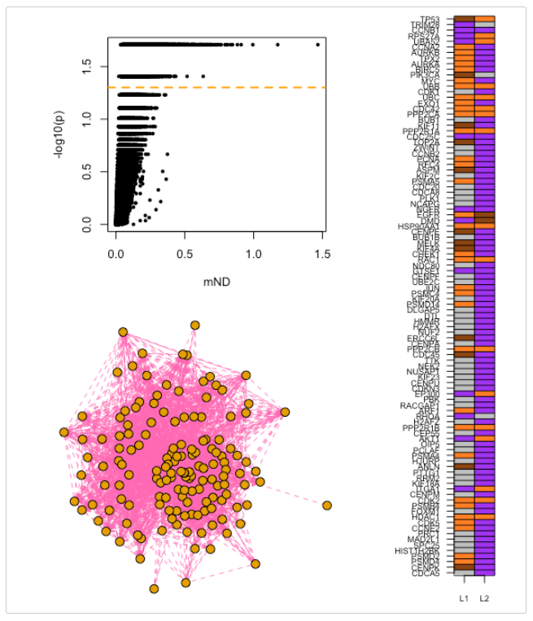

```{r setup, include=FALSE}
knitr::opts_chunk$set(echo = TRUE)
```

---------------------------------------------------------------

# Gene relevance based on multiple evidences in complex networks

#### **Abstract:** Multi-omics approaches offer the opportunity to reconstruct a more complete picture of the molecular events associated with human diseases, but pose challenges in data analysis. Network-based methods for the analysis of multi-omics leverage the complex web of macromolecular interactions occurring within cells to extract significant patterns of molecular alterations. Existing network-based approaches typically address specific combinations of omics and are limited in terms of the number of layers that can be jointly analysed. In this study, we investigate the application of network diffusion to quantify gene relevance on the basis of multiple evidences (layers).

---------------------------------------------------------------

## **Description**

#### This document describes the R package mND (Di Nanni et al. 2019),a new network diffusion based method for **integrative multi-omics analysis.**

#### Let's see what this Algorithm Does first!


---------------------------------------------------------------

### OK... Now, let's see some application - because theory is not so cool.

---------------------------------------------------------------

## **Install Required Packages**

The package can be installed from within R:

* **igraph** is a library and R package for network analysis.
* **TCGAbiolinks** is a Bioconductor package that allows us to retrieve different biological data.
* **mND** is the library for network diffusion based method of integrative multi-omics analysis.
* **Limma** is an R package that allows us to quantify and normalize gene expression.

```{r, message=FALSE }
## Install iGraph for network analysis
## install.packages("igraph")
require(igraph)

## Install mND after downloading package
## install.packages("mND_0.1.7.tar.gz", repos = NULL)
require(mND)

## Install TCGAbiolinks to retrieve Biological Data
## if (!require("BiocManager", quietly = TRUE))
##    install.packages("BiocManager")
## BiocManager::install("TCGAbiolinks")
require(TCGAbiolinks)
library(SummarizedExperiment)
```

---------------------------------------------------------------

## Data Retrieval of Breast Cancer GE & Somatic Mutation

* Somatic mutations and gene expression data from matched tumour-normal samples (blood for SM and solid tissue for GE) were collected from The Cancer Genome Atlas (TCGA) (Tomczak et al. 2015) for BC, using the R package TCGAbiolinks (Colaprico et al. 2015) and considering the human genome version 38 (hg38).

* Mutation Annotation Format files were obtained from 4 pipelines: Muse (Fan et al. 2016), Mutect2 (Cibulskis et al. 2013), SomaticSniper (Larson et al. 2011), Varscan2 (Koboldt et al. 2012). Only mutation sites detected by at least two variant callers were considered. Gene mutation frequencies (f) were calculated as the fraction of subjects in which a gene was associated with at least one mutation.

* Gene expression data were obtained using the TCGA workflow ``HTSeq-Counts’’. The R package limma (Ritchie et al. 2015) was used to normalize and quantify differential expression in matched tumor-normal samples, yielding log-fold changes, the corresponding p-values and FDRs (BH method).

* Interaction network of genes was obtained from STRING database.

Due to time constraints, we will not be running Data Retrieval Pipeline

>> We will use the preprocessed data by the authors of the paper (mND).

>> Sample Code

```{r, eval=FALSE}
## Query TCGA-BRCA project for Gene Expression - Solid Tissue
query.exp <- GDCquery(project = "TCGA-BRCA", 
                      legacy = TRUE,
                      data.category = "Gene expression",
                      data.type = "Gene expression quantification",
                      platform = "Illumina HiSeq", 
                      file.type = "results",
                      experimental.strategy = "RNA-Seq",
                      sample.type = c("Primary Tumor","Solid Tissue Normal"))
GDCdownload(query.exp)
brca.exp <- GDCprepare(query = query.exp, save = TRUE, save.filename = "brcaExp.rda")

# Which samples are Primary Tumor
dataSmTP <- TCGAquery_SampleTypes(getResults(query.exp,cols="cases"),"TP") 
# which samples are solid tissue normal
dataSmTS <- TCGAquery_SampleTypes(getResults(query.exp,cols="cases"),"NT")


# get subtype information
dataSubt_muse <- TCGAquery_subtype(tumor = "BRCA", pipelines = "muse")
dataSubt_varscan <- TCGAquery_subtype(tumor = "BRCA", pipelines = "varscan2")
dataSubt_ss <- TCGAquery_subtype(tumor = "BRCA", pipelines = "somaticsniper")
dataSubt_mutect2 <- TCGAquery_subtype(tumor = "BRCA", pipelines = "mutect2")

## Take only mutations at least present 
## in two subtype information pipelines.
```

---------------------------------------------------------------

## Input data

The package requires:

* An adjacency matrix $(A)$ of undirected interaction network $G$;
* A score matrix $X0=[x1,x2,...,xL]$, in which each column $x_i$ (layer) represents a score vector over all vertices of $G$.
* The number of top $k$-neighbour to consider $(k)$.

Optional arguments are:

* Number of permutations (r) of the input matrix;
* Number of cores (cores).

---------------------------------------------------------------

---------------------------------------------------------------

## First - Exploring the DataSet

#### 1) Adjacency Matrix A - Undirected Interactions Network of Genes


---------------------------------------------------------------

#### 2) Layers Matrix X - Scores of Each Gene over Each Layer

* Each column $x_i$ (layer) represents a score vector over all vertices (genes) of $G$.


---------------------------------------------------------------

---------------------------------------------------------------

## Second - Apply the Mathematics


* 1.1 Generate Permutations & Normalize the Adjacency Matrix

```{r, eval=FALSE}
W <- normalize_adj_mat(A)
X0_perm <- perm_X0(X0, r = 50, W, seed_n = 2)
```

* 1.2 Now, let’s apply network diffusion to our list X0_perm:
```{r, eval=FALSE}
Xs <- ND(X0_perm, W, cores = 4)
```

---------------------------------------------------------------


* 2.1 Get a list of gene neighbors Indices from the Adjacency Matrix (Normalized)
```{r, eval=FALSE}
ind_adj <- neighbour_index(W)
```


* 2.2 Now, we can apply mND function to find functionally related genes on the basis of x∗1 and x∗2 and their top k neighbours;

* The value of k can be optimized exploring the effect of values around 3 on the ranked gene list provided by mND in output (see the optimize_k function).

```{r, eval=FALSE}
mND_score <- mND(Xs, ind_adj, k=3, cores = 4)
```

---------------------------------------------------------------


* 3. Empirical p-values are calculated by using the pool of r permutated versions of X0
```{r}
data(mND_score)
mND_score <- signif_assess(mND_score)
head(mND_score$mND, n=10)
```

---------------------------------------------------------------


Lastly, let’s classify genes in every layer. We define the set of the high scoring genes as:

* H1: genes with a mutation frequency greater than zero;
* H2: top 1200 differentially expressed genes (FDR < 10−7).
* Further, we set the cardinalities of gene sets N1 and N2, containing the genes with the highest scoring neighborhoods, as |H1|=|N1| and |H2|=|N2|.

```{r}
data(X0)
Hl <- list(l1 = rownames(X0[X0[,1]>0,]), 
           l2 = names(X0[order(X0[,2], decreasing = T),2][1:1200])
)
top_Nl <- unlist(lapply(Hl, function(x) length(x)))
top_Nl

class_res <- classification(mND_score, X0, Hl, top = top_Nl)

#Classification of genes in every layer
head(class_res$gene_class)

#Occurrence of (M; L; I; NS) for each gene across layers
head(class_res$occ_labels)
```

---------------------------------------------------------------

---------------------------------------------------------------

A summary of previous results can be obtained with plot_results function, that gives in output the following plots:

* genes ranked by mND score and the corresponding p-value;
* gene networks composed of the top n ranking genes;
* gene classification for the top 100 ranking genes across layers; legend: brown: isolated; orange: linker; purple: module; grey: not significant.


```{r, eval = FALSE}
plot_results(mND_score, class_res, W, n = 150, directory = "~/mND_results")
```


---------------------------------------------------------------

---------------------------------------------------------------

## Third - Summary of all Previous
```{r, eval=FALSE}
W <- normalize_adj_mat(A)
X0_perm <- perm_X0(X0, r = 50, W)
Xs <- ND(X0_perm, W, cores = 4)
ind_adj <- neighbour_index(W)
mND_score <- mND(Xs, ind_adj, k = 3, cores = 4)
mND_score <- signif_assess(mND_score)
class_res <- classification(mND_score, X0, Hl, top, alpha)
#(mND_score, class_res, W, n = 150, directory = "~/mND_results")
```

Most of the analyses can be easily carried out through the wrapper function framework_mND:

```{r, eval=FALSE}
W <- normalize_adj_mat(A)
mND_score <- framework_mND(X0, W, k = 3, r = 50)
class_res <- classification(mND_score, X0, Hl, top, alpha)
#plot_results(mND_score, class_res, W, n = 150, directory = "~/mND_results")
```

---------------------------------------------------------------

# What's Next?

> Enrichment, or Other Anlysis! Since we now have mND p_values :)

---------------------------------------------------------------------

---------------------------------------------------------------------

# Let's Discuss the Constraints on this Network Based Multi-Omics Integration Analysis

### 1. Must have same Edges per Layer

#### This constraint is a downside as it prevents us from adding layers with different interactions.

---------------------------------------------------------------------

### 2. No heuristics - High Computational Time

#### There is threshold in the algorithm - perhaps we can add one?

---------------------------------------------------------------------

### 3. Same Weight on all Layers? Can improve here!

#### Perhaps, one of the layers is more significant than the other layers.


---------------------------------------------------------------------

### 4. Perhaps we should consider further than one level away?

#### Maybe we can select other neighbors? - RESEARCH? MAYBE?


---------------------------------------------------------------------

---------------------------------------------------------------------

# References

---------------------------------------------------------------------

* Cibulskis et al. 2013. “Sensitive Detection of Somatic Point Mutations in Impure and Heterogeneous Cancer Samples.” Nature Biotechnology.

* Colaprico et al. 2015. “TCGAbiolinks: An R/Bioconductor Package for Integrative Analysis of Tcga Data.” Nucleic Acids Research.

* Di Nanni et al. 2019. “Gene Ranking by Multiple Evidences in Complex Networks.” R package version 0.1.0.

* Fan et al. 2016. “MuSE: Accounting for Tumor Heterogeneity Using a Sample-Specific Error Model Improves Sensitivity and Specificity in Mutation Calling from Sequencing Data.” Genome Biology.

* Koboldt et al. 2012. “Somatic Mutation and Copy Number Alteration Discovery in Cancer by Exome Sequencing.” Genome Res.

* Larson et al. 2011. “SomaticSniper: Identification of Somatic Point Mutations in Whole Genome Sequencing Data.” Bioinformatics.

* Ritchie et al. 2015. “Limma Powers Differential Expression Analyses for Rna-Sequencing and Microarray Studies.” Nucleic Acids Research.

* Szklarczyk et al. 2015. “String V10: Protein-Protein Interaction Networks, Integrated over the Tree of Life.” Nucleic Acids Research.

* Tomczak et al. 2015. “The Cancer Genome Atlas (Tcga): An Immeasurable Source of Knowledge.” Contemp Oncol (Pozn).


* Bioinformatics, Volume 36, Issue 3, 1 February 2020, Pages 865–871, https://doi.org/10.1093/bioinformatics/btz652


